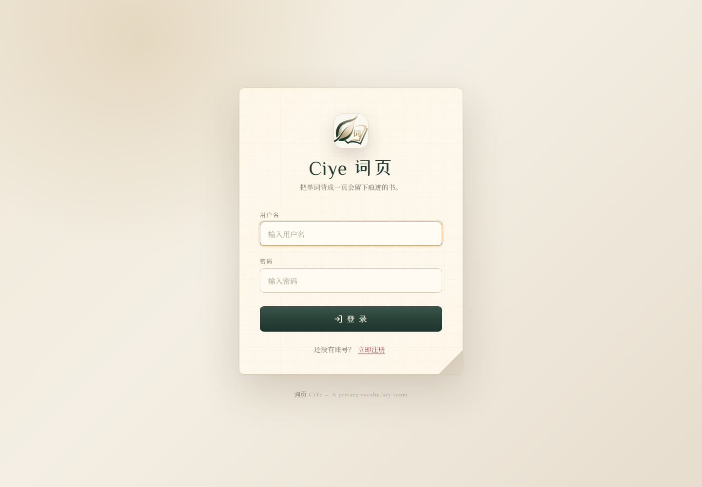
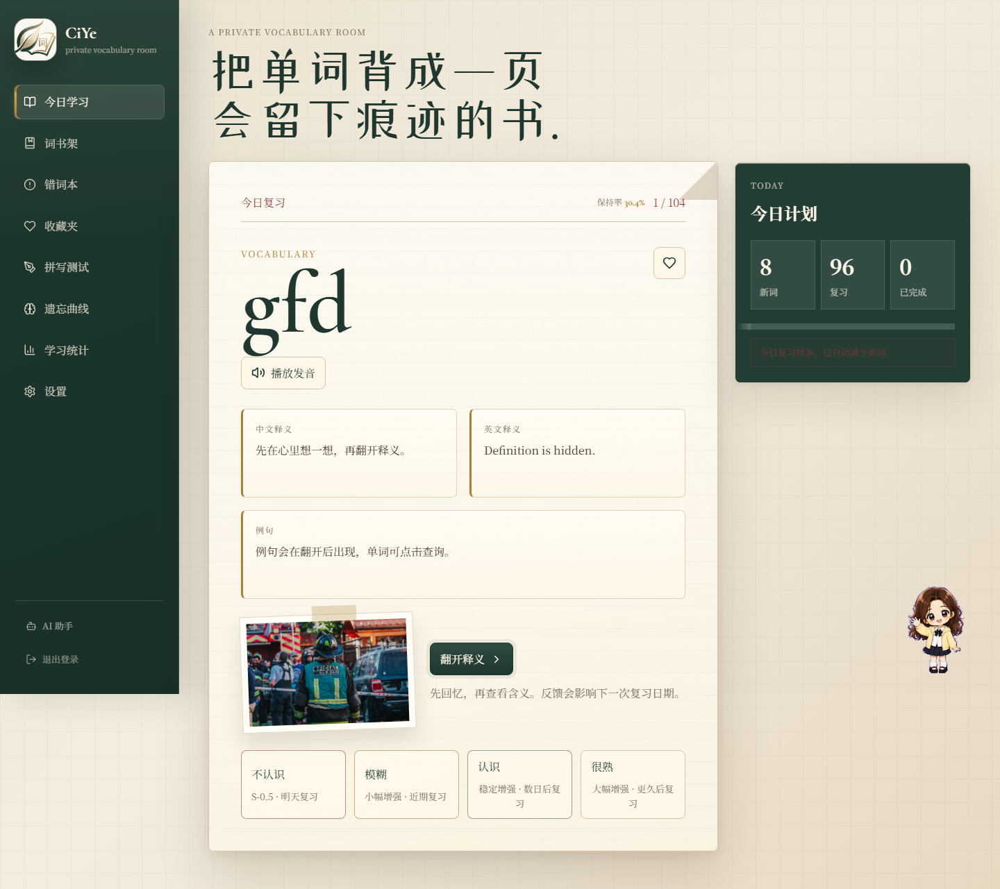
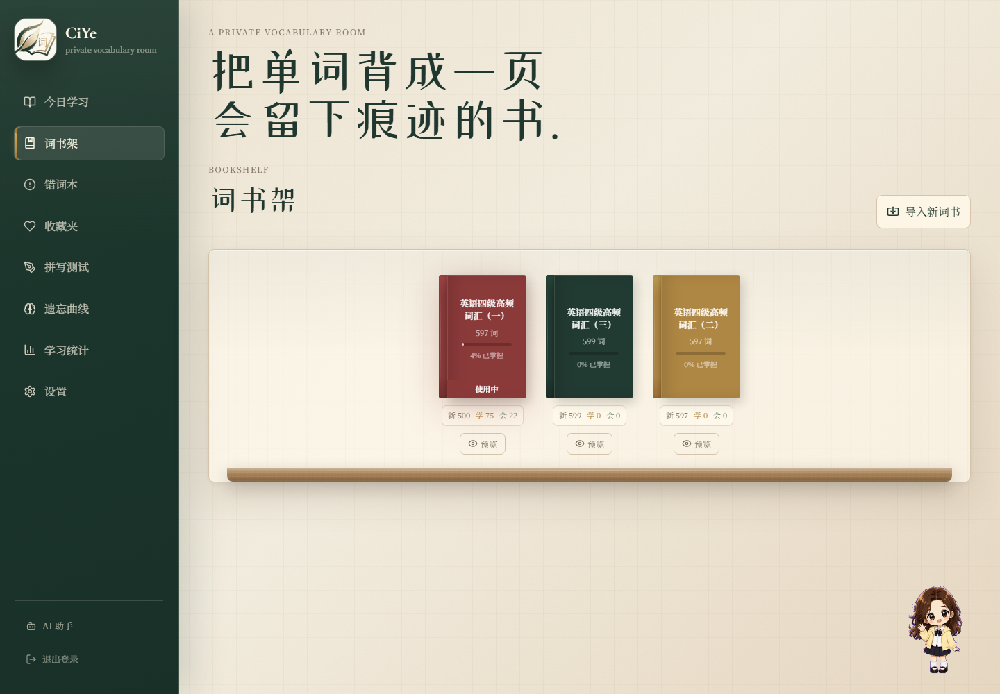
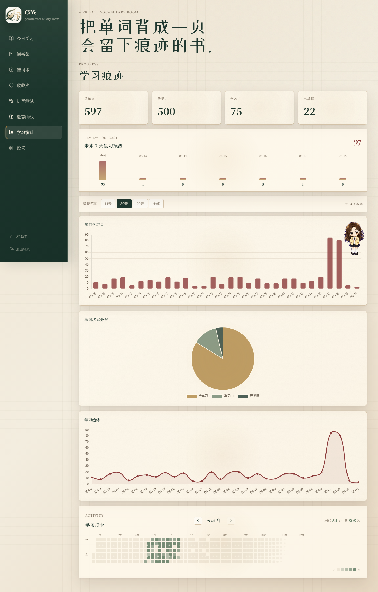
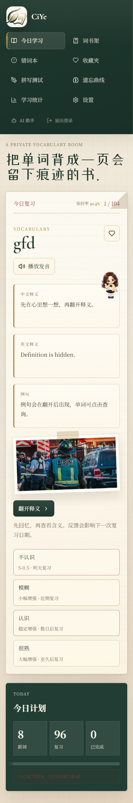

# CiYe Pro 词页

> 把单词背成一页会留下痕迹的书。

CiYe Pro 是一个本地优先的英语背单词系统，围绕「词书管理 + 今日学习 + 间隔复习 + 错词康复 + 拼写测试 + 学习统计 + AI 助手」构建。项目保留原本的文学书房风格，并重构了复习调度、遗忘逻辑、错词闭环和前端视觉系统。

<p>
  
  
  
  
  
</p>

## 界面预览

| 登录页 | 今日学习 |
|---|---|
|  |  |

| 词书架 | 学习统计 |
|---|---|
|  |  |

| 移动端 |
|---|
|  |

## 核心特性

### 学习与复习

- 今日学习队列：自动组合到期复习词和每日新词。
- 四级反馈：不认识、模糊、认识、很熟。
- 记忆强度模型：根据反馈更新 `memory_strength`、`difficulty`、`review_count`、`lapse_count`。
- 到期复习：以 `due_date <= today` 为主，保持率低于阈值作为补充判断。
- 学习负荷保护：复习词过多时自动减少或暂停新词，避免未来复习压力失控。
- 撤销反馈：点错反馈后可以撤销最近一次学习反馈。

### 词书管理

- 多词书书架展示。
- 词书切换和每日新词数设置。
- CSV / TSV / 纯文本导入。
- 导入预览。
- 词表编辑、删除、重置学习进度。
- 公共词书与用户词书隔离。

### 错词与测试

- 拼写测试支持今日已学、错词本、全部已学词。
- 拼错会进入错词本，并按一次 `forgot` 更新复习计划。
- 拼对会按一次 `known` 更新记忆模型。
- 错词连续两次正向反馈后自动移出错词本。
- 错词本展示遗忘次数、下次复习时间和康复提示。

### 统计与可视化

- 总词数、待学习、学习中、已掌握。
- 每日学习量柱状图。
- 状态分布饼图。
- 学习趋势折线图。
- GitHub 风格学习热力图。
- 未来 7 天复习预测。
- 艾宾浩斯遗忘曲线总览和单词详情。

### 词典、发音与配图

- ECDICT 本地离线词典。
- Free Dictionary API 在线补充音标、英文释义、例句和发音。
- 浏览器 TTS 发音兜底。
- Pexels API 记忆配图。
- 例句单词点击查询。

### AI 助手

- 悬浮式 BingBing 英语学习助手。
- 支持拖拽、缩放、位置重置。
- 对话历史按用户保存。
- 支持 OpenAI 兼容接口和 Anthropic Messages 格式。
- 可辅助解释单词、生成例句、整理词书。

## CiYe Pro 的优化重点

这个版本重点解决了原项目中学习逻辑和维护性的问题：

- 新增 `server/scheduler.py`：统一今日队列调度。
- 新增 `server/progress_service.py`：统一反馈、记忆强度、错词和撤销逻辑。
- 补齐缺失 `progress`：切换词书或生成今日队列前自动补齐进度记录。
- 修复复习漏词：复习词不会再因为出现在历史 `studied_ids` 中被错误排除。
- 重构拼写测试：测试结果会反哺主学习模型。
- 改进重置逻辑：今日重置不再误伤历史复习词。
- 前端整体美化：全局视觉系统、侧栏、登录页、书架、统计页、移动端都做了统一提质。
- Windows 构建修复：`npm run build` 不再依赖 Unix `cp` 命令。

## 复习算法简述

系统仍保留艾宾浩斯保持率展示：

```text
R = e^(-t / S)
```

- `R`：当前保持率
- `t`：距上次学习的天数
- `S`：记忆强度

实际调度以 `due_date` 为主：

```text
进入复习队列 = status != new 且 (due_date <= today 或 R < 60%)
```

四级反馈会影响：

- 记忆强度 `memory_strength`
- 难度 `difficulty`
- 复习次数 `review_count`
- 遗忘次数 `lapse_count`
- 下次复习日期 `due_date`
- 错词状态 `is_wrong`

## 技术架构

```text
Browser
  ↓
Vue 3 + Vite
  ↓ fetch /api/*
Python ThreadingHTTPServer
  ↓
SQLite app.db
  ├─ users / sessions
  ├─ books / words
  ├─ progress / events / progress_snapshots
  ├─ daily_session
  ├─ settings
  ├─ pdf_words / pdf_word_marks
  └─ ai_chats

External / optional
  ├─ ECDICT local SQLite
  ├─ Free Dictionary API
  ├─ Pexels API
  └─ OpenAI-compatible AI API
```

## 快速开始

### 环境要求

- Node.js 18+
- Python 3.10+
- SQLite
- 可选：`data/ecdict.db` 本地词典

### 安装依赖

```bash
npm install
```

### 构建前端

```bash
npm run build
```

构建结果会输出到 `public/`，后端会直接服务这个目录。

### 启动应用

```bash
python run.py
```

浏览器打开：

```text
http://127.0.0.1:8765
```

### 修改端口

```bash
# PowerShell
$env:CIYE_PORT="8766"
python run.py
```

## 开发模式

启动后端：

```bash
python run.py
```

另开终端启动 Vite：

```bash
npm run dev
```

开发地址：

```text
http://127.0.0.1:5173
```

Vite 会把 `/api` 代理到 `http://127.0.0.1:8765`。

## 预置账号

首次初始化数据库时会写入几个测试账号：

| 用户名 | 密码 | 角色 |
|---|---|---|
| `earlysleep0913` | `200413` | admin |
| `bing` | `jbjzhkpku200595` | admin |
| `lbw` | `200413` | user |

> 如果你部署给别人使用，请尽快修改或删除预置账号。

## 外部服务配置

### ECDICT 本地词典

将 `ecdict.db` 放入：

```text
data/ecdict.db
```

系统会优先使用本地词典补充中文释义、英文释义和音标。

### Pexels 配图

在设置页填写 Pexels API Key 后，学习卡片会尝试为单词补充记忆配图。

### AI 助手

管理员可在设置页配置：

- API URL
- API Key
- Model
- API 格式：OpenAI compatible / Anthropic Messages

## 项目结构

```text
Ciye_pro/
├─ run.py
├─ package.json
├─ vite.config.js
├─ public/                  # 前端构建产物，后端直接服务
├─ src/
│  ├─ App.vue
│  ├─ main.js
│  ├─ styles/main.css
│  ├─ composables/
│  │  ├─ useApi.js
│  │  └─ useAudio.js
│  └─ components/
│     ├─ StudyCard.vue
│     ├─ BookShelf.vue
│     ├─ EbbinghausPanel.vue
│     ├─ SpellingTest.vue
│     ├─ WrongWords.vue
│     ├─ Favorites.vue
│     ├─ StatsPanel.vue
│     ├─ SettingsPanel.vue
│     └─ AiAssistant.vue
├─ server/
│  ├─ app.py                # API 路由和静态文件服务
│  ├─ db.py                 # SQLite schema / migrations / settings
│  ├─ scheduler.py          # 今日队列和复习调度
│  ├─ progress_service.py   # 学习反馈、撤销、错词康复
│  ├─ ebbinghaus.py         # 遗忘曲线统计和展示
│  ├─ auth.py
│  ├─ dict.py
│  └─ pexels.py
├─ data/
│  ├─ app.db
│  └─ ecdict.db
├─ docs/
│  ├─ screenshots/
│  ├─ 11-项目优化方案.md
│  └─ 12-优化实现记录.md
└─ scripts/
   └─ copy-gifs.mjs
```

## 常用 API

| 方法 | 路径 | 说明 |
|---|---|---|
| `POST` | `/api/auth/login` | 登录 |
| `GET` | `/api/auth/me` | 当前用户 |
| `GET` | `/api/books` | 词书列表 |
| `POST` | `/api/books/activate` | 切换词书 |
| `GET` | `/api/today` | 今日学习队列 |
| `POST` | `/api/progress` | 提交学习反馈 |
| `POST` | `/api/progress/undo` | 撤销最近一次反馈 |
| `GET` | `/api/review-forecast` | 未来 7 天复习预测 |
| `GET` | `/api/ebbinghaus` | 遗忘曲线总览 |
| `GET` | `/api/ebbinghaus/review` | 待复习列表 |
| `GET` | `/api/test/words` | 拼写测试抽词 |
| `POST` | `/api/test/check` | 拼写测试判题 |
| `GET` | `/api/wrong-words` | 错词本 |
| `GET` | `/api/favorites` | 收藏夹 |
| `GET` | `/api/stats` | 学习统计 |

## 数据与隐私

- 默认使用本地 SQLite。
- 学习记录、词书、设置、AI 对话历史均保存在本地数据库。
- 外部 API 只在需要查词、配图或 AI 对话时调用。
- 如果配置了第三方 AI API Key，请注意不要把 `config.json` 和数据库公开上传。

## 已验证

- `python -m py_compile server/app.py server/db.py server/ebbinghaus.py server/scheduler.py server/progress_service.py`
- `npm install`
- `npm run build`
- 登录页、今日学习页、词书架、学习统计页和移动端截图检查
- API smoke test：
  - `/api/today`
  - `/api/review-forecast`
  - `/api/progress`
  - `/api/progress/undo`

## 后续路线

- 单词详情页展示完整学习历史。
- 词书导入质量报告。
- 一键导出词书、错词本和学习记录。
- 更精细的错词康复规则。
- 更完整的测试脚本和 CI。
- AI 根据当前单词生成例句、近义词辨析和记忆法。

## License

MIT
