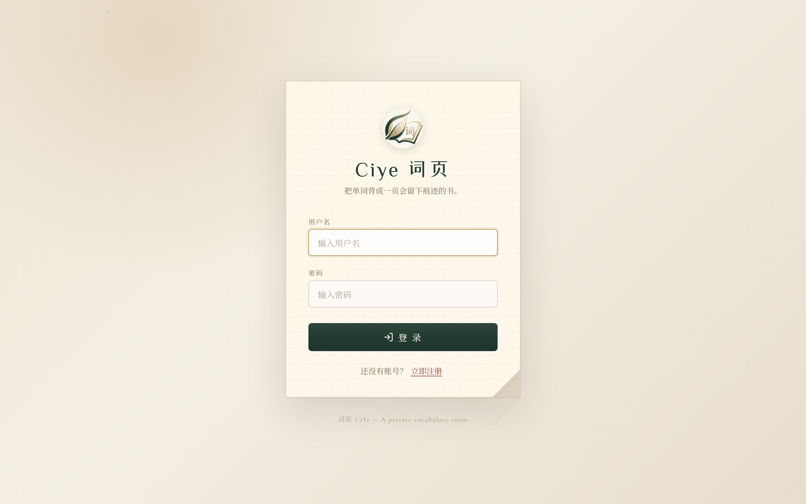
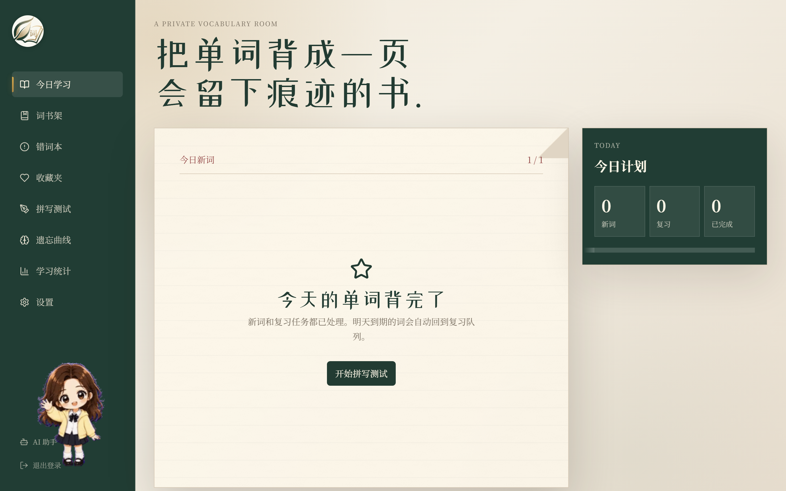
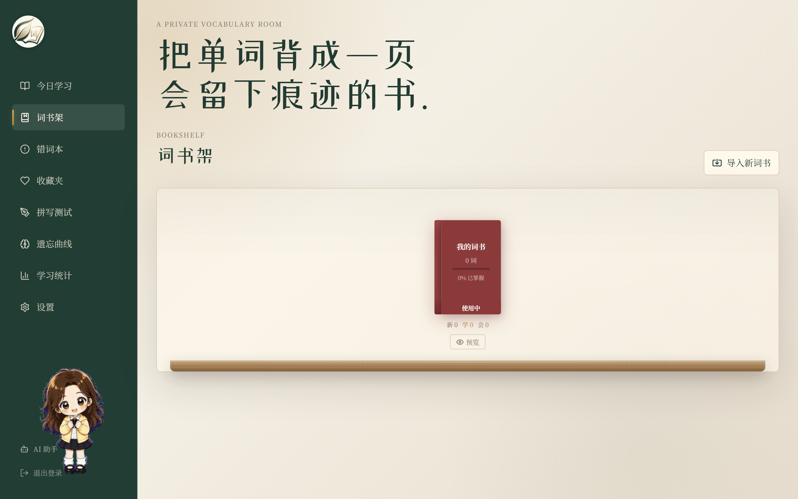
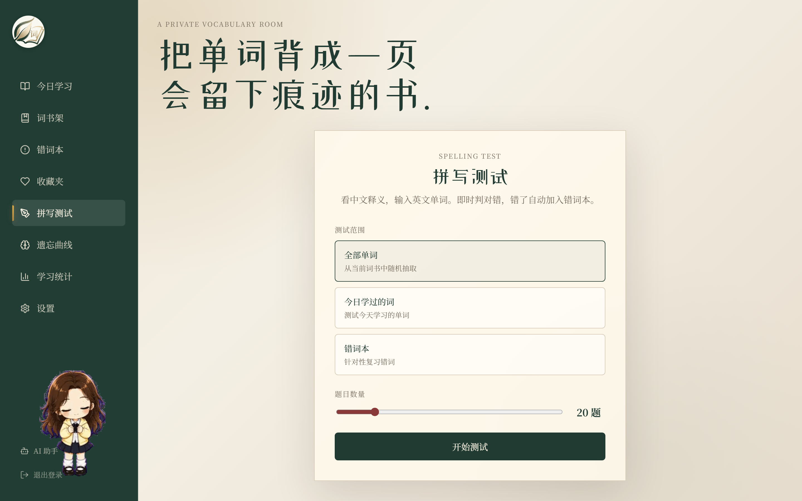
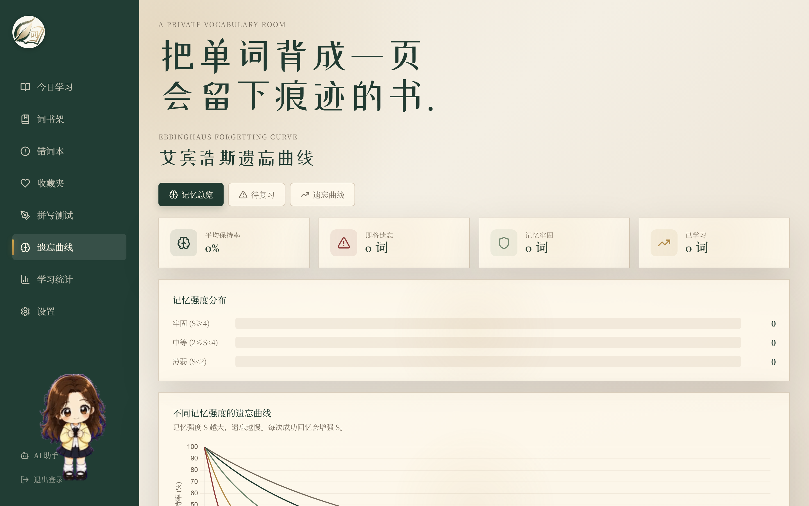
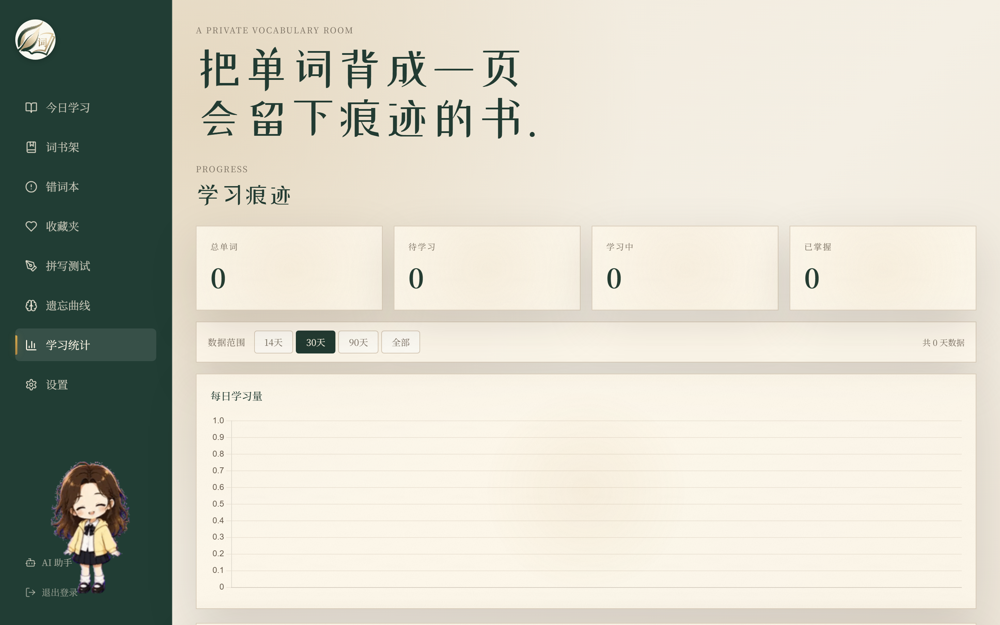
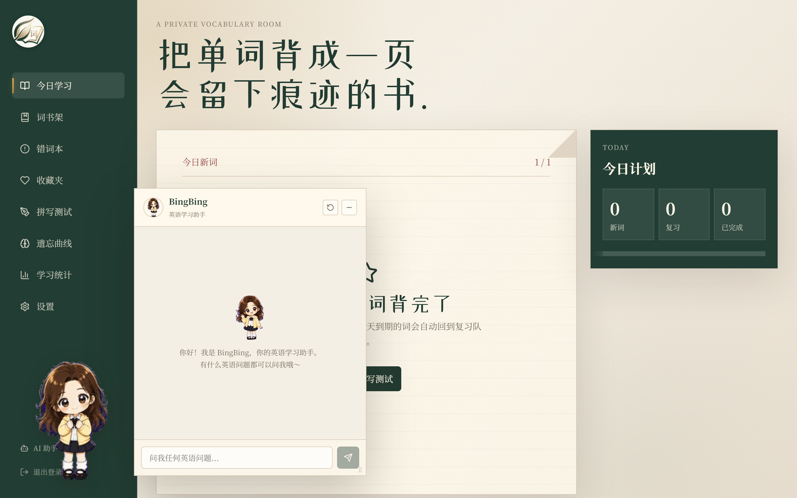
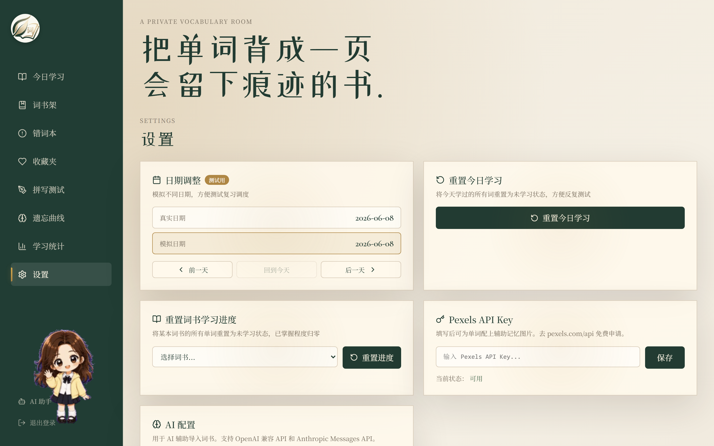

<div align="center">

# 词页 CiYe

**把单词背成一页会留下痕迹的书。**

一个文艺书房风格的英语背单词 Web 应用，基于艾宾浩斯遗忘曲线的智能间隔重复，内置 AI 助手，支持多词书管理、拼写测试、错词本、学习统计。


</div>

---

## 页面预览

| 登录页 | 今日学习 | 学习卡片 |
|:---:|:---:|:---:|
|  |  |  |

| 词书架 | 拼写测试 | 遗忘曲线 |
|:---:|:---:|:---:|
|  |  |  |

| 学习统计 | AI 助手 | 设置 |
|:---:|:---:|:---:|
|  |  |  |

---

## 功能特性

### 学习系统
- **艾宾浩斯遗忘曲线** — 基于 `R = e^(-t/S)` 公式计算记忆保持率，保持率低于 60% 自动安排复习
- **四级反馈** — 不认识 / 模糊 / 认识 / 很熟，每级对应不同的记忆强度变化和复习间隔
- **每日学习计划** — 设定每天新词数量（3-150），系统自动混合新词 + 到期复习词，复习优先
- **动态复习补充** — 每次访问首页自动检查是否有新的复习词到期，实时补充到队列
- **单词详情** — 中文释义、英文释义、音标、例句、发音、记忆配图
- **例句点击查词** — 例句中每个单词可点击查询释义并播放发音

### 拼写测试与错词本
- **拼写测试** — 从已学单词中随机抽取，输入拼写后判断正误，带动画反馈
- **错词本** — 拼写错误的单词自动收录，可手动移除，支持发音朗读
- **收藏夹** — 学习过程中收藏感兴趣的单词，独立列表查看

### 词书管理
- **书架式 UI** — 3D 书籍视觉效果，每本书显示总词数、新词数、学习中、已掌握
- **词书切换** — 点击书架上的书切换当前学习词书，支持设置每日词数
- **CSV 导入** — 支持 CSV / TSV / 纯文本导入，自动识别分隔符和表头
- **AI 整理提示词** — 一键复制提示词模板，配合外部 AI 整理非标准单词资料后导入
- **单词编辑** — 支持编辑单个单词的释义、定义、例句、音标，支持删除单词和整本词书

### 遗忘曲线可视化
- **记忆总览** — 平均保持率、即将遗忘词数、记忆牢固词数、已学习总数
- **记忆强度分布** — 牢固 / 中等 / 薄弱三级分布进度条
- **待复习列表** — 保持率低于 60% 的单词按优先级排序，点击查看遗忘曲线详情
- **曲线图表** — 不同记忆强度的标准遗忘曲线，单词级别曲线带 60% 复习阈值线

### 学习统计
- **数据图表** — 每日学习量柱状图、掌握程度饼图、学习趋势折线图（Chart.js）
- **打卡热力图** — GitHub 风格热力图展示每日学习活跃度，支持按年份切换

### AI 助手（BingBing）
- **悬浮助手** — 右下角可拖拽 GIF 动画按钮，5 种动画循环播放
- **智能对话** — 内置英语教师角色提示词，使用 DeepSeek-V4-Flash 模型，中文回答
- **对话历史** — 按用户隔离保存，刷新不丢失
- **多模型支持** — AI 对话测试中可切换 Kimi-K2.6 / DeepSeek-V4-Flash，支持 OpenAI 兼容和 Anthropic Messages 两种 API 格式

### 发音与图片
- **真实发音优先** — Free Dictionary API 提供真人发音音频
- **浏览器 TTS 兜底** — 音频不可用时自动使用浏览器语音朗读
- **记忆配图** — Pexels API 为具体名词提供辅助记忆图片

### 词典查询
- **ECDICT 本地词典** — 810MB 离线英汉词典，查询速度快
- **Free Dictionary API** — 在线查询音标、英文释义、例句、发音

### 用户系统
- **多用户支持** — 注册登录，Token 认证，用户数据完全隔离
- **角色管理** — 管理员 / 普通用户，管理员可访问设置页面和用户管理
- **用户管理** — 管理员可查看用户列表、设置/取消管理员、删除用户

### 设置（管理员）
- **日期模拟** — 调整虚拟日期，测试不同日期的复习调度
- **学习重置** — 重置今日学习进度 / 重置指定词书全部进度
- **AI 配置** — API URL / Key / Model / Format 设置
- **Pexels 配置** — 输入 API Key 为单词配图

---

## 快速开始

### 环境要求

- **Node.js** 18+
- **Python** 3.10+
- **ECDICT 词典**（可选，首次使用需下载）

### 安装与运行

```bash
# 1. 克隆仓库
git clone https://github.com/EarlySleep0913/Ciye.git
cd Ciye

# 2. 安装前端依赖
npm install

# 3. 构建前端
npm run build

# 4. 下载 ECDICT 词典（可选，约 810MB）
# 将 ecdict.db 放入 data/ 目录

# 5. 启动服务
python run.py
```

浏览器打开 http://127.0.0.1:8765

### 开发模式

```bash
# 启动 Vite 开发服务器（热更新，自动代理 /api 到后端）
npm run dev
# → http://127.0.0.1:5173

# 另一个终端启动后端
python run.py
# → http://127.0.0.1:8765
```

### 默认账号

| 用户名 | 密码 | 角色 |
|--------|------|------|
| `earlysleep0913` | `200413` | 管理员 |
| `bing` | `jbjzhkpku200595` | 管理员 |
| `lbw` | `200413` | 普通用户 |
| `jbj` | `jbjzhkpku200595` | 普通用户（含 90 天演示数据） |

### 外部服务配置（可选）

| 服务 | 用途 | 配置方式 |
|------|------|----------|
| Pexels API | 单词配图 | 设置页面输入 API Key |
| SiliconFlow AI | AI 助手 / 词书生成 | 设置页面配置 API URL、Key、模型 |

---

## 项目结构

```
Ciye/
├── run.py                    # 启动入口
├── package.json              # 前端依赖配置
├── vite.config.js            # Vite 构建配置
├── index.html                # 入口 HTML
│
├── server/                   # Python 后端（零第三方依赖）
│   ├── app.py                # HTTP 服务器 + 全部 API 路由
│   ├── db.py                 # 数据库连接池 + Schema + 迁移
│   ├── auth.py               # 登录注册 / Token 管理
│   ├── ebbinghaus.py         # 遗忘曲线算法
│   ├── dict.py               # ECDICT + Free Dictionary 查询
│   └── pexels.py             # Pexels 图片搜索 + 状态缓存
│
├── src/                      # Vue 3 前端
│   ├── main.js               # 应用入口
│   ├── App.vue               # 根组件（认证门控 + 路由）
│   ├── styles/main.css       # 全局样式（文艺书房风格）
│   ├── composables/
│   │   ├── useApi.js         # Fetch 封装（自动重试 / Token / 超时）
│   │   └── useAudio.js       # 发音播放封装
│   └── components/
│       ├── LoginPage.vue     # 登录页（书卷展开动画）
│       ├── NavRail.vue       # 侧边导航栏
│       ├── StudyCard.vue     # 学习卡片（四级反馈）
│       ├── BookShelf.vue     # 词书架 + 导入
│       ├── BookPreview.vue   # 词书预览 / 编辑
│       ├── SpellingTest.vue  # 拼写测试
│       ├── WrongWords.vue    # 错词本
│       ├── Favorites.vue     # 收藏夹
│       ├── EbbinghausPanel.vue # 遗忘曲线可视化
│       ├── StatsPanel.vue    # 学习统计 + 热力图
│       ├── AiAssistant.vue   # AI 助手（BingBing）
│       ├── SettingsPanel.vue # 设置 + AI 对话测试
│       ├── PdfWordlist.vue   # PDF 词表
│       └── LookupPopover.vue # 查词浮窗
│
├── gif/                      # AI 助手 GIF 动画素材
├── docs/                     # 项目文档
│   ├── 01-项目概述.md ~ 10-页面预览.md
│   └── screenshots/          # 页面截图
│
└── data/                     # 数据目录（gitignore）
    ├── app.db                # 业务数据库（自动生成）
    └── ecdict.db             # ECDICT 词典（需手动下载）
```

---

## 技术架构

```
浏览器
  ↕
Vue 3 前端（Vite 构建，输出到 public/）
  ↕ fetch('/api/...')
Python HTTP Server（标准库，零第三方依赖）
  ↕
SQLite（WAL 模式，线程级连接复用）
  + ECDICT 本地词典（LRU 缓存）
  + Free Dictionary API（在线查词）
  + Pexels API（记忆配图，状态缓存 5 分钟）
  + SiliconFlow AI API（AI 助手 / 词书生成）
```

### 核心算法

**艾宾浩斯遗忘曲线**：`R = e^(-t/S)`
- `R` = 记忆保持率（0~1）
- `t` = 距上次学习的时间
- `S` = 记忆强度（初始 1.0，根据反馈调整）
- 当 `R < 60%` 时触发复习

**反馈对记忆强度的影响**：

| 反馈 | 强度变化 | 大致复习间隔 |
|------|----------|-------------|
| 不认识 | S = max(0.5, S - 0.5) | ~0.5 天 |
| 模糊 | S = S + 0.3 | ~1-2 天 |
| 认识 | S = S + 1.0 | ~2-5 天 |
| 很熟 | S = S + 1.0 | ~5-7 天 |

### 数据库优化

- **线程级连接** — 每个 HTTP 处理线程独立 SQLite 连接，避免并发冲突
- **WAL 模式** — 读写并行，不互相阻塞
- **索引优化** — `progress(status, due_date)`、`words(book_id, word)`、`events(created_at)`
- **ECDICT 缓存** — 词典连接 LRU 缓存，重复查词从内存返回
- **每日队列持久化** — `daily_session` 表存储今日学习队列，刷新不丢失

---

## API 接口

### 认证

所有 `/api/*` 接口需要 `Authorization: Bearer {token}` 请求头（`/api/login` 除外）。

### 接口列表

| 方法 | 路径 | 说明 |
|------|------|------|
| POST | `/api/login` | 登录 |
| GET | `/api/health` | 健康检查 |
| GET | `/api/books` | 词书列表（含学习进度） |
| POST | `/api/books` | 创建词书 |
| DELETE | `/api/books/{id}` | 删除词书 |
| GET | `/api/books/{id}/words` | 词书单词列表 |
| POST | `/api/books/activate` | 切换词书 + 设置每日词数 |
| POST | `/api/books/reset` | 重置词书学习进度 |
| GET | `/api/today` | 今日学习队列（动态补充复习词） |
| POST | `/api/progress` | 提交学习反馈 |
| POST | `/api/favorite` | 切换收藏 |
| GET | `/api/spelling/test` | 获取拼写测试题目 |
| POST | `/api/spelling/check` | 检查拼写结果 |
| GET | `/api/wrong-words` | 错词本列表 |
| POST | `/api/wrong-words/remove` | 移除错词 |
| GET | `/api/ebbinghaus` | 遗忘曲线数据 |
| GET | `/api/ebbinghaus/review` | 待复习列表 |
| GET | `/api/stats` | 学习统计 |
| GET | `/api/lookup?word=xxx` | 查词（ECDICT + Free Dictionary） |
| GET | `/api/settings` | 获取设置 |
| POST | `/api/settings` | 更新设置 |
| POST | `/api/reset-today` | 重置今日学习 |
| POST | `/api/pexels-key` | 保存 Pexels API Key |
| POST | `/api/import/preview` | 预览导入词书 |
| POST | `/api/ai/chat` | AI 对话测试 |
| POST | `/api/ai/generate` | AI 词书生成 |
| POST | `/api/ai/assistant` | AI 助手对话 |
| GET | `/api/ai/history` | AI 助手对话历史 |
| GET | `/api/pdf-words` | PDF 词表 |
| POST | `/api/pdf-words/mark` | PDF 单词标记 |

---

## 设计风格

- **字体** — Cormorant Garamond（英文标题）、Noto Serif SC（中文正文）、ZCOOL XiaoWei（装饰）
- **配色** — 纸张米色 `#f4efe4`、墨绿 `#223b32`、暗红 `#8b3a3a`、金色 `#af8744`
- **布局** — 桌面端左侧导航栏 + 右侧内容区，720px 以上响应式适配
- **质感** — 纸张纹理背景、书脊阴影、折角装饰、胶带便签效果
- **动效** — Vue 自定义指令 `v-reveal`（滚动渐显）、`v-spotlight`（光斑追踪）

---

## 文档

项目详细文档位于 `docs/` 目录：

| 文档 | 内容 |
|------|------|
| 01-项目概述.md | 项目背景、技术栈、架构 |
| 02-功能清单.md | 完整功能列表 |
| 03-数据库设计.md | 表结构、索引、ER 关系 |
| 04-后端架构.md | API 路由、认证、核心模块 |
| 05-前端架构.md | 组件结构、Composables、样式系统 |
| 06-算法详解.md | 遗忘曲线、复习调度算法 |
| 07-部署指南.md | 安装、配置、运行 |
| 08-外部服务集成.md | Free Dictionary、ECDICT、Pexels、AI API |
| 09-需求分析.md | 完整需求规格说明 |
| 10-页面预览.md | 全部页面截图 |

---

## 开源协议

MIT License
